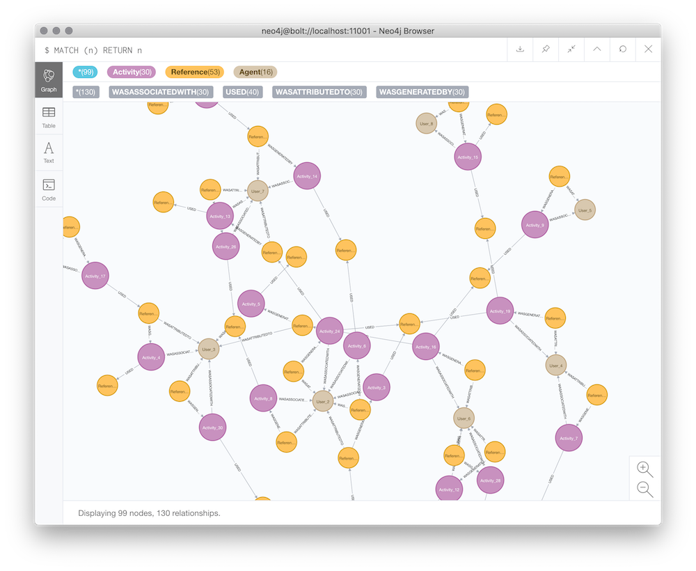
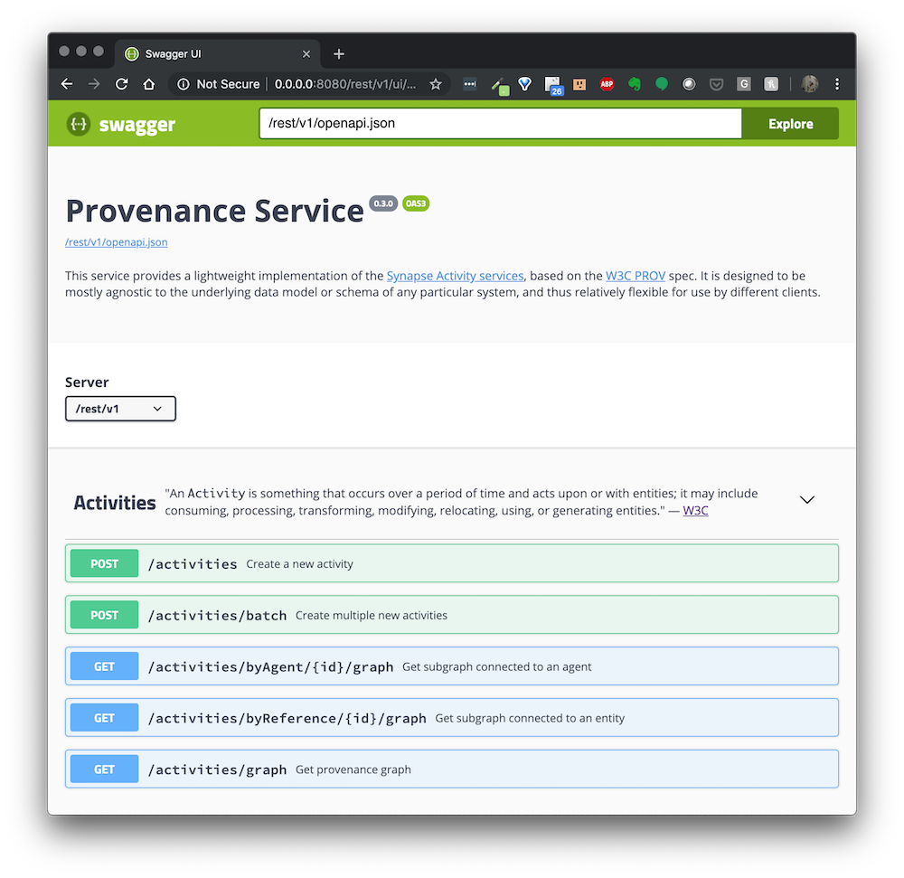

# Provenance Service
[](https://travis-ci.com/Sage-Bionetworks/prov-service) [](https://coveralls.io/github/Sage-Bionetworks/prov-service?branch=master&service=github)

Lightweight implementation of the Synapse Activity services, based on the PROV spec.

## Overview

This is an OpenAPI-enabled (and documented) Flask server. This example uses the [Connexion](https://github.com/zalando/connexion) library on top of Flask. The [py2neo]() driver library for Python is used to manage operations between RESTful API requests/responses and a Neo4j database.

This server was originally generated by the [OpenAPI Generator](https://openapi-generator.tech) project. Starting with the Synapse Activity API specification in a `swagger.yaml` file, the contents of this repo were originally generated with the following command:

```shell
npx openapi-generator generate -i swagger.yaml -g python-flask -DpackageName=synprov -o prov-service/
```

## Requirements

Python 3.5.2+

You should have access to a local installation of Neo4j, serving at `bolt://localhost/7687`.

You'll also need to set two environment variables based on your Neo4j configuration (the Flask app uses these to connect to the database):

```shell
export NEO4J_USERNAME=<username>
export NEO4J_PASSWORD=<password>
```

## Usage

To run the server, please execute the following from the root directory:

```shell
pip install -r requirements.txt .
```

To start the app, you can use this command:
```shell
synprov
```

### Neo4j browser

If you have the **Neo4j Desktop** application installed, you should be able to view and explore the graph database using Cypher queries. For example, to view all nodes and relationships:

```cypher
MATCH (n) RETURN n
```




### Swagger UI

You can also interact with the graph database through RESTful API queries. The service provides a Swagger UI endpoint to test requests through the browser:

```
http://localhost:8080/rest/ui/
```




The OpenAPI definition lives here:

```
http://localhost:8080/rest/openapi.json
```

## Running with Docker

To run the server on a Docker container, first store the username and password from your environment as a file under `data/dbms`:

```shell
bash .build/build_auth_string.sh ${NEO4J_USERNAME}:${NEO4J_PASSWORD} > data/dbms/auth
```

Then execute the following from the root directory:

```shell
docker-compose up --build
```

> **Note:** In order to use the server container, which requires a Neo4j database connection, you should have [Docker Compose](https://docs.docker.com/compose/overview/) installed.

After running this command, the URLs in the previous section should work.

## Development

To add changes locally, install the package in developer mode:
```shell
pip install -r requirements.txt -e .
```

### OpenAPI Generator

The core `models` and `controllers` for the server are generated automatically from the OpenAPI specification. Classses and methods used for operations within the app all inherit from auto-generated definitions.

Anytime the OpenAPI spec is modified, controller and model code should be regenerated with the following command:

```shell
npx openapi-generator generate \
    -c .openapi-generator-config \
    -t .codegen/server \
    -Dmodels \
    -DmodelTests=false \
    -Dapis \
    -DapiTests=false \
    -i synprov/openapi/openapi.yaml \
    -g python-flask \
    -o .
```

**Note:** this will happen during the continuous integration process regardless, so regenerating and testing locally is just advised to save time troubleshooting.

